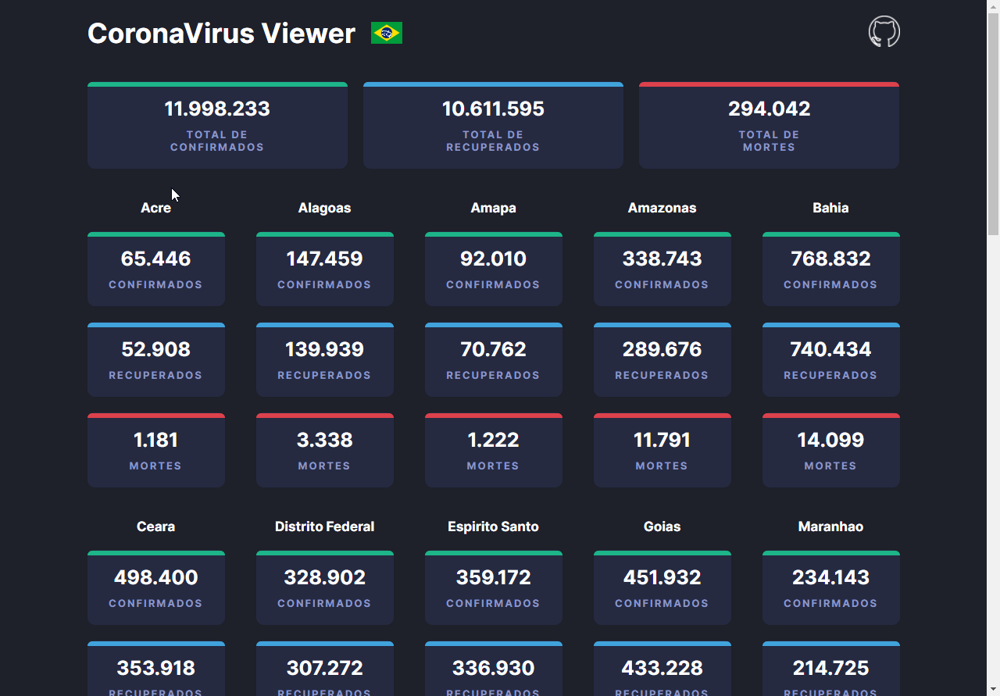
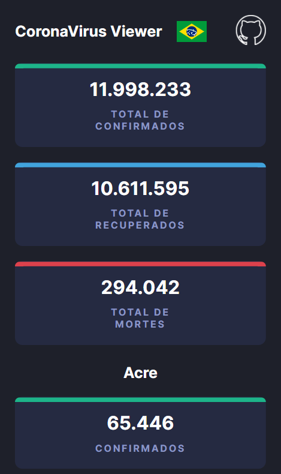

  
  
  
  

  

 
  
     
    
     
     
  

 <a href="#eye_speech_bubble-visualizar">Visualizar</a> •
 <a href="#information_source-sobre">Sobre</a> • 
 <a href="#hammer_and_wrench-tecnologias">Tecnologias</a> • 
 <a href="#brain-conceitos-aplicados">Conceitos</a> • 
 <a href="#boy-autor">Autor</a> •
 <a href="#balance_scale-licença">Licença</a>

---

## :eye_speech_bubble: **Visualizar**

Deploy do front-end efetuado no [Netlify](https://www.netlify.com/) para visualizar: [Clique Aqui](https://kz-corona-virus-viewer.netlify.app/)

|                             :computer:Desktop                             |                             :iphone: Mobile                              |
| :-----------------------------------------------------------------------: | :----------------------------------------------------------------------: |
| <kbd></kbd> | <kbd></kbd> |

  
---

## :information_source: Sobre

Página simples que apenas manipula e lista os dados retornados pela [Covid-API](https://covid-api.mmediagroup.fr/v1/cases).

---

## :hammer_and_wrench: **Tecnologias**

|                    :globe_with_meridians: FrontEnd                    |
| :-------------------------------------------------------------------: |
|      [HTML 5](https://developer.mozilla.org/en-US/docs/Web/HTML)      |
|       [CSS 3](https://developer.mozilla.org/en-US/docs/Web/CSS)       |
| [JavaScript](https://developer.mozilla.org/en-US/docs/Web/JavaScript) |

---

## :brain: **Conceitos Aplicados**

| :page_facing_up: |
| :--------------: |
|     Flex-box     |
|   Grid Layout    |
|   Dynamic HTML   |
| DOM Manipulation |
|    Fetch API     |
|    Regex Mask    |

---

## :boy: **Autor**

<a href="https://github.com/gleisonkz">
 
  
 <b>Gleison de Almeida</b>
</a>

Desenvolvido com ❤️ por Gleison Almeida 👋🏽 Meus Contatos!

---

## :balance_scale: **Licença**

Copyright © 2021 [Gleison Almeida](https://github.com/gleisonkz). 
This project is licensed by [MIT](./LICENSE).

